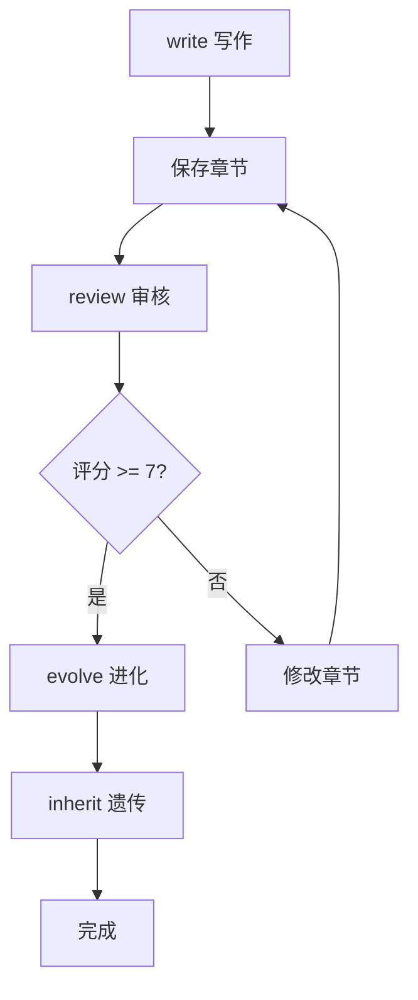

# Novel Workflow 小说创作工作流

## 快速索引

- **命令**：见 [命令](#命令)
- **集成模块**：见 [集成模块](#集成模块)
- **工作流程**：见 [工作流程](#工作流程)
- **输出格式**：见 [输出格式](#输出格式)

---

## 概述

`novel-workflow.py` 是一个整合工作流脚本，将小说创作系统与 EvoMap 进化系统连接。

**核心功能**：
1. 写作阶段：继承经验，生成写作提示
2. 审核阶段：调用审核代理，五大维度评分
3. 进化阶段：生成胶囊和基因
4. 遗传阶段：更新经验库

---

## 命令

### 写作阶段

```bash
python scripts/novel-workflow.py write "第19章" "深入万妖岭遭遇黑纹豹" --inherit
```

**参数**：
| 参数 | 说明 |
|------|------|
| `write` | 启动写作阶段 |
| `<章节>` | 章节标题 |
| `<大纲>` | 章节要点 |
| `--inherit` | 可选，继承上一章经验 |

**输出示例**：
```
📚 继承经验:
   胶囊: 3 个
   基因: 5 个

🧬 推荐基因:
   - 感官轰炸: 增加战斗场景的感官描写
   - 镜头切换: 使用远景→中景→近景的镜头切换
   - 临阵磨枪: 主角在战斗中突破

📝 写作提示:
根据以下要点和技法创作第19章：
...
```

### 保存章节

```bash
python scripts/novel-workflow.py save "章节内容..."
```

**参数**：
| 参数 | 说明 |
|------|------|
| `save` | 保存章节到文件 |
| `<内容>` | 章节markdown内容 |

**注意**：内容较长时建议直接编辑文件，或用 heredoc：
```bash
python scripts/novel-workflow.py save "$(cat chapter.md)"
```

### 审核章节

```bash
python scripts/novel-workflow.py review "第19章-深入万妖岭.md"
```

**功能**：
1. 读取章节文件
2. 调用审核代理评分
3. 输出五大维度分数
4. 列出问题和建议

**输出示例**：
```
🔍 开始审核: 第19章-深入万妖岭.md
==================================================

📊 审核结果: 7.7/10
   等级: B+

   维度分数:
   ┌─────────────┬────────┐
   │ 内部逻辑    │ 7.7    │
   │ 外部逻辑    │ 7.6    │
   │ 情节人物    │ 7.8    │
   │ 叙事结构    │ 7.5    │
   │ 修真特有    │ 7.7    │
   └─────────────┴────────┘

⚠️  问题列表:
   - [中] 建议增加更多感官描写
     → 使用感官轰炸技法

✅ 审核通过: 7.7 >= 7.0
```

### 进化阶段

```bash
python scripts/novel-workflow.py evolve "第19章" 7.7 "感官描写不足"
```

**参数**：
| 参数 | 说明 |
|------|------|
| `evolve` | 启动进化阶段 |
| `<章节>` | 章节标题 |
| `<评分>` | 审核评分 |
| `<问题>` | 问题列表（逗号分隔） |

**功能**：
1. 构建胶囊（包含场景、技法、指标）
2. 发布胶囊到胶囊库
3. 从问题生成新基因

**输出示例**：
```
🧬 开始进化: 第19章
==================================================

📦 胶囊已发布: capsule_20260224_001
   - 章节: 第19章
   - 技法: 感官轰炸, 镜头切换, 内心独白
   - 评分: 7.7

🧬 基因已生成: gene_sensory_bomb_001
   - 来源问题: 感官描写不足
   - 解决方案: 为第19章开发的解决方案

✅ 进化完成:
   胶囊: 1 个
   基因: 1 个
```

### 遗传更新

```bash
python scripts/novel-workflow.py inherit
```

**功能**：
- 统计胶囊库和基因库
- 识别高分胶囊（>=8分）和基因
- 输出经验库统计

**输出示例**：
```
🔄 遗传更新
==================================================

📊 经验库统计:
   总胶囊: 15
   总基因: 28
   高分胶囊(>=8): 3
   高分基因(>=8): 8
```

### 完整工作流

```bash
python scripts/novel-workflow.py run "第19章-深入万妖岭.md"
```

**功能**：
1. 审核章节 → 2. 审核通过则进化 → 3. 更新遗传

### 查看状态

```bash
python scripts/novel-workflow.py status
```

---

## 集成模块

### 1. EvoMap 胶囊构建器

路径：`../novel-evomap/scripts/capsule_builder.py`

**功能**：从章节内容构建可复用的经验胶囊

**使用示例**：
```python
from capsule_builder import CapsuleBuilder

builder = CapsuleBuilder()
capsule = builder.build(
    chapter="第19章",
    content="章节内容...",
    techniques_used=["感官轰炸", "镜头切换"],
    tags=["战斗", "第19章"],
    score=7.7,
    metadata={
        "key_scenes": ["洞穴战斗", "黑纹豹出现"],
        "metrics": {"logic_score": 7.7}
    }
)
builder.publish(capsule)
```

### 2. EvoMap 继承引擎

路径：`../novel-evomap/scripts/inheritance.py`

**功能**：从胶囊库和基因库继承经验

**使用示例**：
```python
from inheritance import InheritanceEngine

engine = InheritanceEngine()
report = engine.inherit_all("战斗", ["战斗"])

print(f"胶囊: {report['capsules_found']} 个")
print(f"基因: {len(report['recommended_genes'])} 个")

for gene in report['recommended_genes'][:3]:
    print(f"  - {gene['name']}: {gene['description']}")

prompt = engine.generate_writing_prompt("战斗", "洞穴战斗场景")
```

---

## 工作流程

### 标准流程



### 交互模式

直接运行 `python scripts/novel-workflow.py` 进入交互模式：

```
==================================================
小说创作自动工作流
==================================================

命令:
  python scripts/novel-workflow.py write <章节> <大纲> [--inherit]
  python scripts/novel-workflow.py review <文件>
  python scripts/novel-workflow.py evolve <章节> <评分> <问题>
  python scripts/novel-workflow.py inherit
  python scripts/novel-workflow.py run <文件>
  python scripts/novel-workflow.py status

示例:
  python scripts/novel-workflow.py write '第18章' '修炼突破' --inherit
  python scripts/novel-workflow.py review 第18章-修炼突破.md
  python scripts/novel-workflow.py inherit
```

---

## 输出格式

### JSON 输出

所有命令支持 JSON 输出（可用于自动化）：

```bash
python scripts/novel-workflow.py write "第19章" "内容" | jq .
```

**write 输出结构**：
```json
{
  "action": "write",
  "chapter": "第19章",
  "timestamp": "2026-02-24T23:00:00",
  "inherit": true,
  "result": null,
  "inherit_report": {
    "capsules_found": 3,
    "recommended_genes": [...]
  },
  "prompt": "根据以下要点..."
}
```

**review 输出结构**：
```json
{
  "file": "第19章-深入万妖岭.md",
  "total_score": 7.7,
  "grade": "B+",
  "dimensions": {
    "内部逻辑": 7.7,
    "外部逻辑": 7.6,
    "情节人物": 7.8,
    "叙事结构": 7.5,
    "修真特有": 7.7
  },
  "issues": [...],
  "passed": true,
  "word_count": 6200
}
```

---

## 与其他技能的集成

### 1. 与写作技法集成

配合 `../openclaw-writing-skills/SKILL.md` 使用：

```python
# 在写作提示中加入技法
techniques = [
    "感官轰炸",  # 战斗场景
    "镜头切换",  # 场景切换
    "冰山博弈层"  # 心理描写
]

# 自动应用到写作提示
```

### 2. 与审核代理集成

配合 `../novel-editor/agent-prompt.md` 使用：

```python
# 自定义审核标准
agent_prompt = """
请审核以下小说章节...

评分权重：
- 内部逻辑: 20%
- 外部逻辑: 20%
- 情节人物: 25%
- 叙事结构: 15%
- 修真特有: 20%

段落规则：
- 禁止一句话一个段落
- 每段至少2-5句话
- 对话需配合动作/表情
"""
```

### 3. 与逻辑检查集成

配合 `../novel-logic-checker/` 使用：

```python
# 在进化阶段调用逻辑检查
from logic_checker import NovelLogicChecker

checker = NovelLogicChecker()
result = checker.check_chapter(content)
if result.is_valid:
    print("✅ 逻辑检查通过")
else:
    print(f"⚠️  问题: {result.issues}")
```

---

## 文件结构

```
novel-workflow/
├── SKILL.md                    # 本文件
├── scripts/
│   ├── __init__.py
│   ├── novel-workflow.py       # 主工作流脚本
│   └── send-chapter.py         # 发送章节脚本
└── README.md                   # 快速指南
```

---

## 进阶用法

### 批量处理

```bash
# 审核所有未处理的章节
for file in 第*.md; do
    python scripts/novel-workflow.py review "$file"
done
```

### 自定义审核标准

修改 `SKILL.md` 中的 `agent_prompt` 部分：

```python
def _call_editor_agent(self, file_path: str, content: str) -> Dict:
    # 自定义审核逻辑
    ...
```

### CI/CD 集成

```yaml
# .github/workflows/novel.yml
name: Novel Review
on:
  push:
    paths:
      - '第*.md'

jobs:
  review:
    runs-on: ubuntu-latest
    steps:
      - uses: actions/checkout@v3
      - name: Review Chapter
        run: |
          pip install -r requirements.txt
          python scripts/novel-workflow.py review ${{ matrix.chapter }}
```

---

## 故障排除

### 问题：审核代理无响应

**原因**：多代理通信未配置

**解决方案**：
```bash
# 检查代理状态
openclaw sessions list

# 或使用模拟审核
python scripts/novel-workflow.py review file.md --simulate
```

### 问题：EvoMap 胶囊无法发布

**原因**：胶囊目录权限不足

**解决方案**：
```bash
chmod -R 755 ../novel-evomap/capsules/
```

### 问题：基因库未更新

**原因**：基因生成后未保存

**解决方案**：
```python
# 手动保存基因
gene_engine.gene_lib.save_genes("combat")
```

---

## 参考

- **写作技法**：`../openclaw-writing-skills/SKILL.md`
- **审核代理**：`../novel-editor/agent-prompt.md`
- **逻辑检查**：`../novel-logic-checker/SKILL.md`
- **EvoMap系统**：`../novel-evomap/SKILL.md`
- **剧情图谱**：`../novel-evomap/atlas/PLOT_ATLAS.md`
